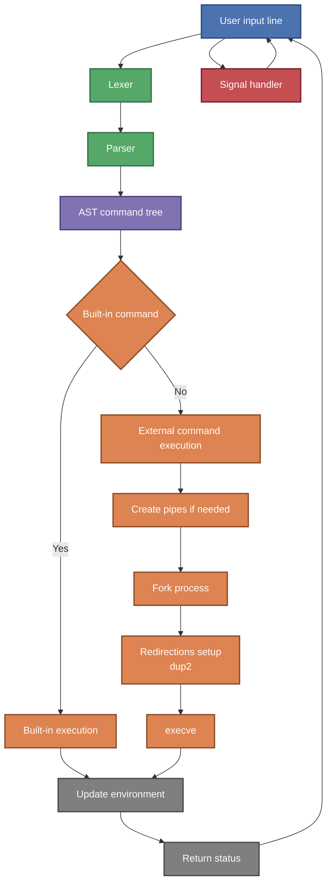

# Minishell - A Custom Shell with Extra Features

  
📌 **42 School - Unix Process & Shell Project**  

## ▌ Description
**Minishell** is a **minimalistic shell** that mimics the behavior of **Bash**.  
It supports command execution, environment variables, redirections, pipes, and **additional enhancements beyond the mandatory requirements**.  
Developed as a **team project** with [Christophe Albor Pirame](https://github.com/CronopioSalvaje), we **extended** its functionality with unique features.




## ▌ Key Features
▸ **Bash-like prompt** with Git branch detection  
▸ **Supports standard shell operators** (`|`, `>`, `<`, `>>`, `<<`)  
▸ **Built-in commands** (`cd`, `pwd`, `echo`, `export`, `unset`, `env`, `exit`)  
▸ **Handles environment variables (`$VAR`)**  
▸ **Executes scripts (`./minishell script.sh`)**  
▸ **Runs a second Minishell in the background for special commands**  
▸ **Signal handling (`Ctrl-C`, `Ctrl-D`, `Ctrl-\`)**  

## ▌ Result: **125% Score**
The project was successfully validated with a **125% score**, including bonus implementations. 🎉

## ▌ Files
- `minishell.h` → Contains function prototypes and required macros  
- `minishell.c` → Main loop handling user input and execution  
- `Makefile` → Automates compilation (`all`, `clean`, `fclean`, `re`, `bonus`)  

## ▌ Extended Features
### **■ Enhanced Prompt (Zsh-like)**
- Displays **current directory** and **Git branch (if inside a repository)**.
- Changes prompt color dynamically.

### **■ Advanced Execution Handling**
- Supports executing **shell scripts** via `./minishell script.sh`.
- Runs a **second Minishell in the background** for executing special commands.

### **■ Redirections & Pipes**
| Operator | Description |
|----------|-------------|
| `<` | Redirects input from a file |
| `>` | Redirects output to a file |
| `>>` | Appends output to a file |
| `<<` | Here-document (reads input until a delimiter) |
| `|` | Pipes command output to the next command |

### **■ Bonus Features**
| Feature | Description |
|---------|-------------|
| ▸ **Logical Operators (`&&`, `||`)** | Executes commands based on success/failure |
| ▸ **Wildcard Expansion (`*`)** | Expands filenames in the current directory |
| ▸ **Advanced Path Handling** | Supports tilde (`~`) and variable expansion |
| ▸ **Process Subshells** | Runs commands in a separate subshell when needed |

## ▌ Compilation & Usage
### ■ **Compile the Program**
```sh
make
``` 

### ■ **Run Minishell**
```sh
./minishell  
```

### ■ **Execute a Script**
```sh
./minishell my_script.sh  
```

### ■ **Use Pipes & Redirections**
```sh
echo "Hello" | cat > output.txt  
```

### ■ **Check Git Status in the Prompt**
```sh
cd my_git_repo  
minishell
```

## 📜 License

This project was completed as part of the **42 School** curriculum.  
It is intended for **academic purposes only** and follows the evaluation requirements set by 42.  

Unauthorized public sharing or direct copying for **grading purposes** is discouraged.  
If you wish to use or study this code, please ensure it complies with **your school's policies**.  
